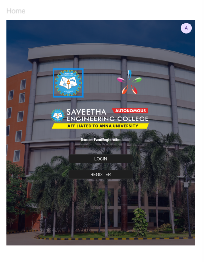
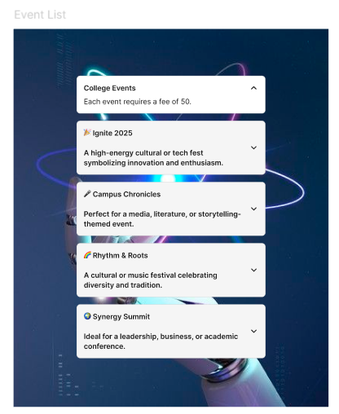
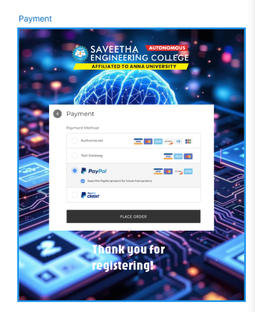
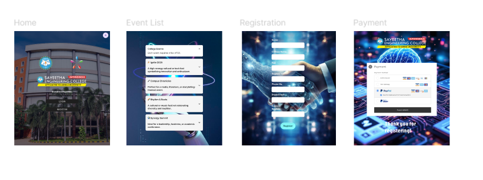

# Ex09 Event Registration Web Application
## Date: 09/11/2025

## AIM:
To design, develop and deploy a web application for event registration.

## DESIGN STEPS:

### Step 1:
Create a new frame.

### Step 2:
Select any one preset size of your choice.

### Step 3:
Select the shapes you need.

### Step 4:
Import images as needed.

### Step 5:
Create pages based on your need and link them.

### Step 6:

Validate the HTML and CSS code.

### Step 6:

Publish the website in the given URL.

## DESIGN TOOL:
Figma

## CODE:

# Home Page

index.html
```html

<!DOCTYPE html>
<html>
  <head>
    <meta name="viewport" content="width=device-width, initial-scale=1" />
    <meta charset="utf-8" />
    <link rel="stylesheet" href="globals.css" />
    <link rel="stylesheet" href="style.css" />
  </head>
  <body>
    <div class="image"></div>
  </body>
</html>
```
```css

globals.css

@import url("https://cdnjs.cloudflare.com/ajax/libs/meyer-reset/2.0/reset.min.css");
* {
  -webkit-font-smoothing: antialiased;
  box-sizing: border-box;
}
html,
body {
  margin: 0px;
  height: 100%;
}
/* a blue color as a generic focus style */
button:focus-visible {
  outline: 2px solid #4a90e2 !important;
  outline: -webkit-focus-ring-color auto 5px !important;
}
a {
  text-decoration: none;
}
```
style.css

```css
.image {
  width: 959px;
  height: 872px;
}

.image .img {
  position: fixed;
  top: 0;
  left: 23px;
  width: 700px;
  height: 840px;
  aspect-ratio: 1.1;
  object-fit: cover;
}
```
# Events Page

index.html

```html
<!DOCTYPE html>
<html>
  <head>
    <meta name="viewport" content="width=device-width, initial-scale=1" />
    <meta charset="utf-8" />
    <link rel="stylesheet" href="globals.css" />
    <link rel="stylesheet" href="styleguide.css" />
    <link rel="stylesheet" href="style.css" />
  </head>
  <body>
    <div class="event-list">
      
      <div class="accordion">
        <div class="accordion-item">
          <div class="accordion-title">
            <div class="title">College Events</div>
            
          </div>
          <div class="accordion-content"><p class="body">Each event requires a fee of 50.</p></div>
        </div>
        <div class="accordion-title-wrapper">
          <div class="div">
            <p class="title">
              🎉 Ignite 2025 <br /><br />A high-energy cultural or tech fest symbolizing innovation and enthusiasm.
            </p>
            
          </div>
        </div>
        <div class="div-wrapper">
          <div class="div">
            <p class="title">
              🎤 Campus Chronicles <br /><br />Perfect for a media, literature, or storytelling-themed event.
            </p>
            
          </div>
        </div>
        <div class="accordion-item-2">
          <div class="div">
            <p class="title">
              🌈 Rhythm &amp; Roots <br /><br />A cultural or music festival celebrating diversity and tradition.
            </p>
            
          </div>
        </div>
        <div class="accordion-item-3">
          <div class="div">
            <p class="title">🌍 Synergy Summit <br /><br />Ideal for a leadership, business, or academic conference.</p>
            
          </div>
        </div>
      </div>
    </div>
  </body>
</html>
```

globals.css

```css
@import url("https://cdnjs.cloudflare.com/ajax/libs/meyer-reset/2.0/reset.min.css");
* {
  -webkit-font-smoothing: antialiased;
  box-sizing: border-box;
}
html,
body {
  margin: 0px;
  height: 100%;
}
/* a blue color as a generic focus style */
button:focus-visible {
  outline: 2px solid #4a90e2 !important;
  outline: -webkit-focus-ring-color auto 5px !important;
}
a {
  text-decoration: none;
}
```

style.css

```css
.event-list {
  background-color: #ffffff;
  width: 100%;
  min-width: 700px;
  min-height: 840px;
  position: relative;
}

.event-list .image {
  position: absolute;
  top: 0;
  left: 0;
  width: 700px;
  height: 840px;
  aspect-ratio: 0.67;
  object-fit: cover;
}

.event-list .accordion {
  display: flex;
  flex-direction: column;
  width: 420px;
  height: 83px;
  align-items: flex-start;
  gap: var(--size-space-400);
  position: absolute;
  top: 104px;
  left: 140px;
}

.event-list .accordion-item {
  flex-direction: column;
  align-items: flex-start;
  gap: var(--size-space-200);
  padding: var(--size-padding-lg);
  align-self: stretch;
  width: 100%;
  flex: 0 0 auto;
  margin-bottom: -1.00px;
  background-color: var(--color-background-default-default);
  border-radius: var(--size-radius-200);
  border: 1px solid;
  border-color: var(--color-border-default-default);
  display: flex;
  position: relative;
}

.event-list .accordion-title {
  display: flex;
  align-items: center;
  gap: var(--size-space-200);
  position: relative;
  align-self: stretch;
  width: 100%;
  flex: 0 0 auto;
}

.event-list .title {
  position: relative;
  flex: 1;
  margin-top: -1.00px;
  font-family: var(--body-strong-font-family);
  font-weight: var(--body-strong-font-weight);
  color: var(--color-text-default-default);
  font-size: var(--body-strong-font-size);
  letter-spacing: var(--body-strong-letter-spacing);
  line-height: var(--body-strong-line-height);
  font-style: var(--body-strong-font-style);
}

.event-list .img {
  position: relative;
  width: 20px;
  height: 20px;
}

.event-list .accordion-content {
  align-items: center;
  justify-content: center;
  align-self: stretch;
  width: 100%;
  flex: 0 0 auto;
  display: flex;
  position: relative;
}

.event-list .body {
  position: relative;
  display: flex;
  align-items: center;
  justify-content: center;
  flex: 1;
  margin-top: -1.00px;
  font-family: var(--body-base-font-family);
  font-weight: var(--body-base-font-weight);
  color: var(--color-text-default-default);
  font-size: var(--body-base-font-size);
  letter-spacing: var(--body-base-letter-spacing);
  line-height: var(--body-base-line-height);
  font-style: var(--body-base-font-style);
}

.event-list .accordion-title-wrapper {
  margin-bottom: -137.00px;
  display: flex;
  align-items: center;
  padding: var(--size-padding-lg);
  position: relative;
  align-self: stretch;
  width: 100%;
  flex: 0 0 auto;
  background-color: var(--color-background-default-secondary);
  border-radius: var(--size-radius-200);
  border: 1px solid;
  border-color: var(--color-border-default-default);
}

.event-list .div {
  align-items: center;
  gap: var(--size-space-200);
  flex: 1;
  flex-grow: 1;
  display: flex;
  position: relative;
}

.event-list .div-wrapper {
  margin-bottom: -273.00px;
  display: flex;
  align-items: center;
  padding: var(--size-padding-lg);
  position: relative;
  align-self: stretch;
  width: 100%;
  flex: 0 0 auto;
  background-color: var(--color-background-default-secondary);
  border-radius: var(--size-radius-200);
  border: 1px solid;
  border-color: var(--color-border-default-default);
}

.event-list .accordion-item-2 {
  margin-bottom: -409.00px;
  display: flex;
  align-items: center;
  padding: var(--size-padding-lg);
  position: relative;
  align-self: stretch;
  width: 100%;
  flex: 0 0 auto;
  background-color: var(--color-background-default-secondary);
  border-radius: var(--size-radius-200);
  border: 1px solid;
  border-color: var(--color-border-default-default);
}

.event-list .accordion-item-3 {
  margin-bottom: -545.00px;
  display: flex;
  align-items: center;
  padding: var(--size-padding-lg);
  position: relative;
  align-self: stretch;
  width: 100%;
  flex: 0 0 auto;
  background-color: var(--color-background-default-secondary);
  border-radius: var(--size-radius-200);
  border: 1px solid;
  border-color: var(--color-border-default-default);
}
```

styleguide.css

```css
:root {
  --body-strong-font-family: "Inter", Helvetica;
  --body-strong-font-weight: 600;
  --body-strong-font-size: 16px;
  --body-strong-letter-spacing: 0px;
  --body-strong-line-height: 139.9999976158142%;
  --body-strong-font-style: normal;
  --body-base-font-family: "Inter", Helvetica;
  --body-base-font-weight: 400;
  --body-base-font-size: 16px;
  --body-base-letter-spacing: 0px;
  --body-base-line-height: 139.9999976158142%;
  --body-base-font-style: normal;
  --color-text-default-default: var(--color-primitives-gray-900);
  --color-background-default-secondary: var(--color-primitives-gray-100);
  --color-border-default-default: var(--color-primitives-gray-300);
  --color-background-default-default: var(--color-primitives-white-1000);
  --color-primitives-gray-900: rgba(30, 30, 30, 1);
  --color-primitives-white-1000: rgba(255, 255, 255, 1);
  --color-primitives-gray-100: rgba(245, 245, 245, 1);
  --color-primitives-gray-300: rgba(217, 217, 217, 1);
  --color-primitives-gray-800: rgba(44, 44, 44, 1);
  --color-primitives-gray-600: rgba(68, 68, 68, 1);
  --size-space-200: 8px;
  --size-padding-lg: 16px;
  --size-radius-200: 8px;
  --size-space-400: 16px;
}

/*

To enable a theme in your HTML, simply add one of the following data attributes to an HTML element, like so:

<body data-color-mode="SDS-light">
    <!-- the rest of your content -->
</body>

You can apply the theme on any DOM node, not just the `body`

*/

[data-color-mode="SDS-light"] {
  --color-text-default-default: var(--color-primitives-gray-900);
  --color-background-default-secondary: var(--color-primitives-gray-100);
  --color-border-default-default: var(--color-primitives-gray-300);
  --color-background-default-default: var(--color-primitives-white-1000);
}

[data-color-mode="SDS-dark"] {
  --color-text-default-default: var(--color-primitives-white-1000);
  --color-background-default-secondary: var(--color-primitives-gray-800);
  --color-border-default-default: var(--color-primitives-gray-600);
  --color-background-default-default: var(--color-primitives-gray-900);
}

[data-color-mode="brand-b-light"] {
  --color-text-default-default: var(--color-primitives-gray-900);
  --color-background-default-secondary: var(--color-primitives-gray-100);
  --color-border-default-default: var(--color-primitives-gray-300);
  --color-background-default-default: var(--color-primitives-white-1000);
}
```

# Registration

index.html

```html
<!DOCTYPE html>
<html>
  <head>
    <meta name="viewport" content="width=device-width, initial-scale=1" />
    <meta charset="utf-8" />
    <link rel="stylesheet" href="globals.css" />
    <link rel="stylesheet" href="style.css" />
  </head>
  <body>
    <div class="image"></div>
  </body>
</html>
```

global.css

```css
@import url("https://cdnjs.cloudflare.com/ajax/libs/meyer-reset/2.0/reset.min.css");
* {
  -webkit-font-smoothing: antialiased;
  box-sizing: border-box;
}
html,
body {
  margin: 0px;
  height: 100%;
}
/* a blue color as a generic focus style */
button:focus-visible {
  outline: 2px solid #4a90e2 !important;
  outline: -webkit-focus-ring-color auto 5px !important;
}
a {
  text-decoration: none;
}
```
style.css

```css
.image {
  width: 728px;
  height: 946px;
}

.image .img {
  position: fixed;
  top: 93px;
  left: 0;
  width: 687px;
  height: 840px;
  aspect-ratio: 0.77;
  object-fit: cover;
}
```

# Payment

index.html

```html
<!DOCTYPE html>
<html>
  <head>
    <meta name="viewport" content="width=device-width, initial-scale=1" />
    <meta charset="utf-8" />
    <link rel="stylesheet" href="globals.css" />
    <link rel="stylesheet" href="style.css" />
  </head>
  <body>
    <div class="payment">
      
      <div class="text-wrapper">Thank you for registering!</div>
      
      
    </div>
  </body>
</html>
```

globals.css

```css
@import url("https://cdnjs.cloudflare.com/ajax/libs/meyer-reset/2.0/reset.min.css");
* {
  -webkit-font-smoothing: antialiased;
  box-sizing: border-box;
}
html,
body {
  margin: 0px;
  height: 100%;
}
/* a blue color as a generic focus style */
button:focus-visible {
  outline: 2px solid #4a90e2 !important;
  outline: -webkit-focus-ring-color auto 5px !important;
}
a {
  text-decoration: none;
}
```

style.css

```css
.payment {
  background-color: #ffffff;
  overflow: hidden;
  width: 100%;
  min-width: 700px;
  min-height: 840px;
  position: relative;
}

.payment .element {
  position: absolute;
  top: 0;
  left: 0;
  width: 700px;
  height: 840px;
  aspect-ratio: 0.56;
  object-fit: cover;
}

.payment .text-wrapper {
  position: absolute;
  top: 655px;
  left: 226px;
  width: 340px;
  font-family: "Jaro-Regular", Helvetica;
  font-weight: 400;
  color: #ffffff;
  font-size: 40px;
  letter-spacing: 0;
  line-height: normal;
}

.payment .img {
  position: absolute;
  top: 234px;
  left: 94px;
  width: 512px;
  height: 390px;
  aspect-ratio: 1.31;
  object-fit: cover;
}

.payment .logo {
  position: absolute;
  top: 35px;
  left: 153px;
  width: 393px;
  height: 105px;
  aspect-ratio: 3.75;
  object-fit: cover;
}
```

## OUTPUT:










## RESULT:
The program to design, develop and deploy a web application for event registration is completed successfully.